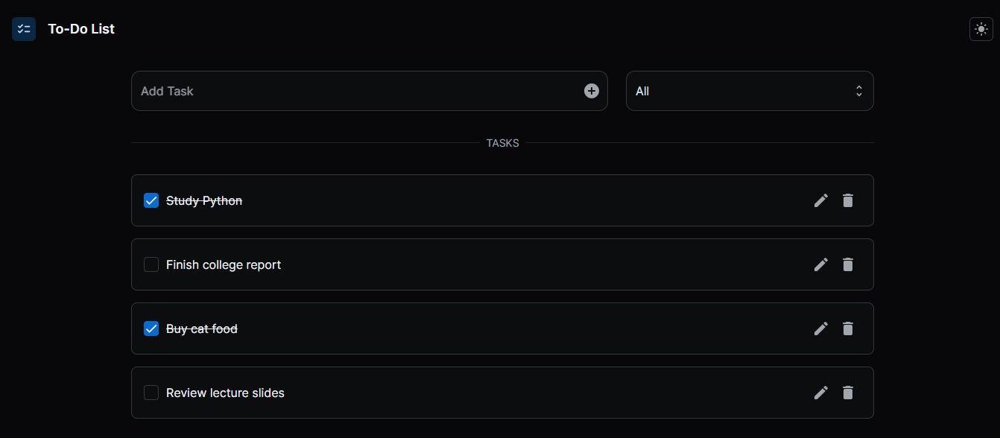

# django-react-todo-app

This is a simple Todo List application built with Django and React + Joy UI.



## Features

- Create new tasks
- Update existing tasks
- Delete tasks
- Filter tasks by status (all, complete, incomplete)

## Backend

The backend is built with Django and provides a REST API for managing tasks. The main model is `Task`, which represents a task with a title and a completion status.

## Frontend

The frontend is built with React and Joy UI. It communicates with the backend through the REST API to provide a user interface for managing tasks. The main page is `TodoPage`, which displays the list of tasks and allows the user to create, update, delete, and filter tasks.

The `ApiService` module in the frontend provides functions for interacting with the backend API, including fetching tasks, creating new tasks, updating existing tasks, and deleting tasks.

## Getting Started

To get started with this project:

1. **Clone the repository**

    Use the following command to clone this repository:

    ```bash
    git clone git@github.com:lele-sf/django-react-todo-app.git
    ```

2. **Set up a virtual environment (optional but recommended)**

    It's a good practice to create a virtual environment for your Python projects. This isolates your project and its dependencies from other projects.

    ```bash
    python -m venv env
    source env/bin/activate  # On Windows, use `env\Scripts\activate`
    ```

3. **Install the backend dependencies**

    Navigate to the project directory and install the required backend dependencies:

    ```bash
    pip install -r requirements.txt
    ```

4. **Install the frontend dependencies**

    Navigate to the frontend directory and install the required frontend dependencies:

    ```bash
    cd frontend
    npm install
    ```

5. **Build the frontend**

    In the frontend directory, run the build command:

    ```bash
    npm run build
    cd ..
    ```

    This will create a `build` directory in the `frontend` directory with the optimized, bundled frontend code.

6. **Prepare the database**

    Apply the migrations to create your database schema:

    ```bash
    python manage.py migrate
    ```

7. **Start the Django server**

    You can start the Django server with the following command:

    ```bash
    python manage.py runserver
    ```

    Now, you should be able to navigate to `http://127.0.0.1:8000/` in your web browser and see the application.

## Contributing

Contributions are welcome! Please feel free to submit a Pull Request.
